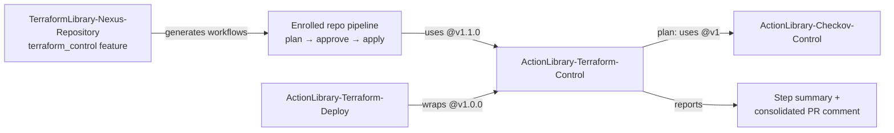

# ActionLibrary-Terraform-Control

| **Home**
| [Changelog](./CHANGELOG.md)
| [Contributing](./CONTRIBUTING.md)
| [Tech Doc](./techdoc.md)
| <!-- End Of Menu -->

---

## Purpose

Composite GitHub Action that runs Terraform (`plan`, `apply`, `destroy`, `validate`, `fmt`) with enterprise-grade reporting. A `plan` invocation chains `terraform init` → `terraform validate` → Checkov security scan → `terraform plan`, then renders a structured result — resource counts, per-resource diffs, drift, extracted errors and Checkov findings — into both the workflow step summary and a single **consolidated PR comment** shared by every plan job on the pull request.

## Position in the system

`ActionLibrary-Terraform-Control` is the execution engine of the Nexus Terraform pipeline. The `terraform_control` feature of [TerraformLibrary-Nexus-Repository](https://github.com/crosswave-technology/TerraformLibrary-Nexus-Repository) generates workflows into enrolled repositories whose plan and apply jobs call this action; during plan it delegates security scanning to [ActionLibrary-Checkov-Control](https://github.com/crosswave-technology/ActionLibrary-Checkov-Control). [ActionLibrary-Terraform-Deploy](https://github.com/crosswave-technology/ActionLibrary-Terraform-Deploy) wraps it for standalone single-account AWS use.



## Quickstart

Current version: `v1.1.5` (see [`VERSION`](./VERSION)). Only `working-directory` is required; credentials for your Terraform providers must already be configured in the job (the generated Nexus workflows assume an AWS role via OIDC first).

```yaml
permissions:
  contents: read
  pull-requests: write   # for the consolidated PR comment

steps:
  - uses: actions/checkout@v4

  - name: Configure AWS credentials
    uses: aws-actions/configure-aws-credentials@v4
    with:
      role-to-assume: arn:aws:iam::111111111111:role/Terraform-Repo-Plan
      aws-region: eu-west-1

  - name: Terraform plan
    uses: crosswave-technology/ActionLibrary-Terraform-Control@v1.0.0
    with:
      working-directory: infrastructure/aws
      command: plan                     # default; also apply / destroy / validate / fmt
      terraform-version: "1.5.7"        # installed if terraform is not on the runner
      comment-section-id: plan-111111111111   # keeps matrix jobs in one PR comment
```

For `apply`, pass `command: apply` with `apply-args` pointing at a saved plan file (the Nexus pipeline uploads `terraform.plan` as an artifact between the plan and apply jobs) and `auto-approve: "true"`.

## Capabilities at a glance

- **Consolidated PR comments** — every plan job upserts its own named section (`comment-section-id`) into one `<!-- crosswave-terraform-report -->` comment instead of posting a new comment per run.
- **Structured plan output** — add/change/destroy counts, collapsible per-resource diffs, drift detection, warnings, and an optional raw-plan expander in the step summary.
- **Error extraction** — on plan failure, distinct `Error:` blocks are parsed from the plan log into the `plan_error_file` / `plan_error_count` outputs.
- **Security gate** — Checkov scan via `ActionLibrary-Checkov-Control@v1` with a configurable severity threshold (`checkov-fail-severities`).
- **Rich outputs** — 14 outputs covering exit codes, change counts and file paths; see the [tech doc](./techdoc.md) for the full tables.

## Navigation

| Document | Contents |
|---|---|
| [techdoc.md](./techdoc.md) | Execution flow, inputs/outputs reference, comment architecture, security posture, limitations |
| [CHANGELOG.md](./CHANGELOG.md) | Release history (v1.0.1 → v1.1.5) |
| [CONTRIBUTING.md](./CONTRIBUTING.md) | Contribution and release process |
| [logs/](./logs) | Per-version release logs |

---

*Nexus docs-restructure mission · 2026-08-04 · pending Sean review.*
